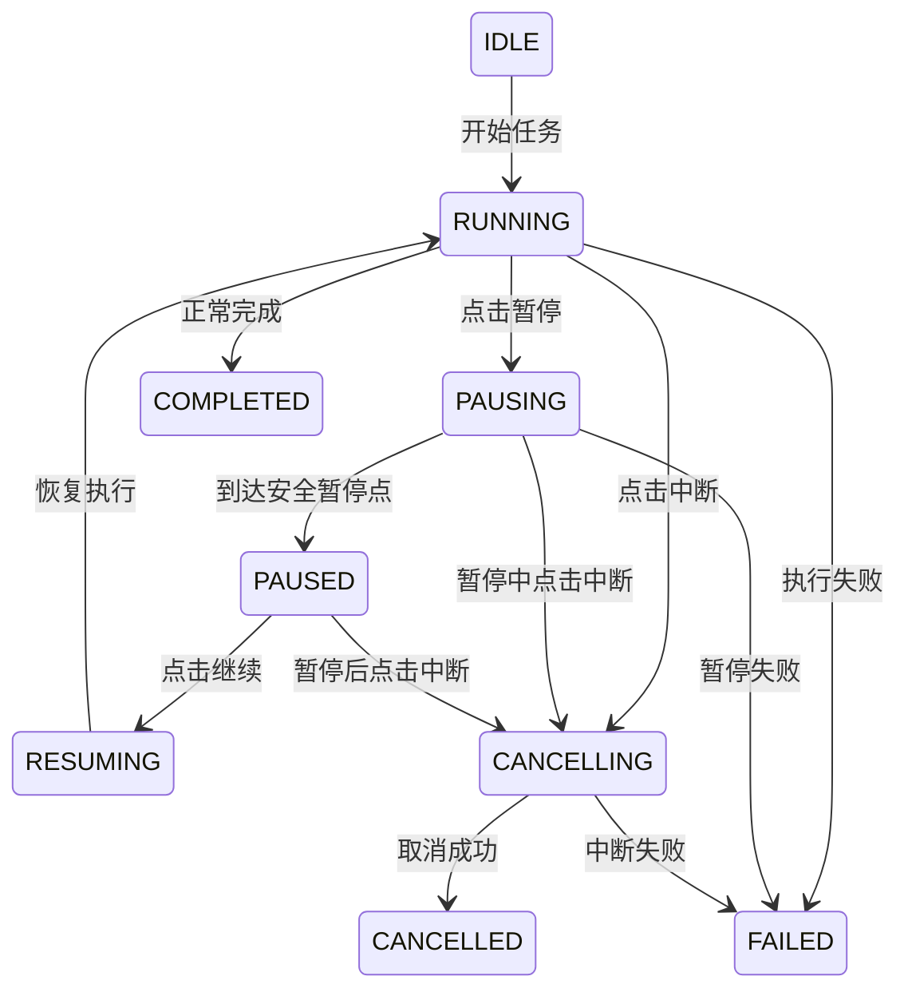

# 仿 Codex App 推理任务暂停与中断需求设计方案

## 1. 需求背景

在仿 Codex App 的 AI 推理任务中，用户可能会遇到以下情况：

1. AI 推理方向跑偏，继续执行会浪费时间。
2. 用户发现当前任务目标描述不准确，需要修改指令。
3. AI 正在生成用户不想要的内容。
4. AI 正在执行耗时较长的推理、工具调用、代码分析或文件修改。
5. 用户希望临时暂停，确认后再继续。
6. 用户希望直接中断本次任务，保留当前结果和执行日志。

因此，需要在 App 中支持对正在运行的 AI 推理任务进行 **暂停、继续、中断** 控制。

---

## 2. 设计目标

本功能的目标是为 AI 推理任务提供可控的执行生命周期。

核心目标如下：

1. 支持用户在任务运行过程中主动暂停。
2. 支持用户在暂停后继续执行。
3. 支持用户直接中断当前推理任务。
4. 支持在中断后保留已生成内容、任务日志、工具调用记录。
5. 支持用户基于中断前的上下文重新发起任务。
6. 避免 AI 在用户明确中断后继续输出内容。
7. 避免工具调用、文件修改、命令执行在中断后继续产生不可控影响。
8. 为后续任务重试、重新规划、人工接管提供基础能力。

---

## 3. 功能范围

### 3.1 本期支持

本期需要支持以下能力：

1. 推理任务运行中显示「暂停」和「中断」按钮。
2. 点击「暂停」后，任务进入暂停状态。
3. 暂停后用户可以选择：

   * 继续执行
   * 中断任务
   * 补充指令后继续
4. 点击「中断」后，当前任务立即进入中断流程。
5. 中断后前端停止接收 AI 流式输出。
6. 后端停止继续推理、工具调用、命令执行和文件写入。
7. 保留中断前的推理内容和执行日志。
8. 任务卡片显示最终状态：已暂停、已中断、已完成、失败。

### 3.2 本期不支持

本期暂不支持以下能力：

1. 对已经提交给第三方模型 API 的单次请求进行真正的物理级暂停。
2. 对已经执行完成的命令进行回滚。
3. 对已经写入文件的内容自动恢复。
4. 多人协作场景下的复杂权限控制。
5. 跨设备实时同步暂停状态。

---

## 4. 概念定义

### 4.1 暂停

暂停指用户临时停止当前 AI 任务继续向后执行。

暂停不是简单地停止前端展示，而是要求后端任务进入可恢复状态。

暂停后需要保留：

1. 当前任务上下文。
2. 已生成内容。
3. 当前执行步骤。
4. 已完成的工具调用结果。
5. 未完成任务的状态。

暂停后用户可以选择继续执行。

### 4.2 中断

中断指用户明确放弃当前推理任务。

中断后任务不可继续，只能基于已有上下文重新创建一个新任务。

中断后需要保留：

1. 已生成内容。
2. 中断前的执行日志。
3. 当前推理阶段。
4. 中断原因。
5. 是否由用户主动中断。

### 4.3 补充指令后继续

用户在暂停状态下，可以输入新的补充指令。

例如：

> 当前方向不对，不要继续分析论文，改成只总结代码结构。

系统需要把补充指令追加到当前任务上下文中，然后继续执行。

---

## 5. 用户交互设计

## 5.1 运行中状态

当 AI 推理任务正在运行时，任务区域展示：

```text
AI 正在推理中...

[暂停] [中断]
```

按钮说明：

| 按钮 | 说明                |
| -- | ----------------- |
| 暂停 | 临时停止当前任务，保留现场，可继续 |
| 中断 | 停止当前任务，不再继续执行     |

---

## 5.2 点击暂停后的交互

用户点击「暂停」后，前端立即将按钮状态改为：

```text
正在暂停当前任务...

[暂停中...] [中断]
```

后端确认暂停成功后，展示：

```text
任务已暂停

你可以继续执行，也可以补充指令后继续，或者中断本次任务。

[继续执行] [补充指令后继续] [中断任务]
```

---

## 5.3 暂停后补充指令

用户点击「补充指令后继续」后，展示输入框：

```text
请输入新的补充指令：

[输入框]

[继续执行] [取消]
```

示例：

```text
不要继续写论文内容了，只保留技术路线和模块设计。
```

提交后，任务状态从 `PAUSED` 变为 `RUNNING`。

---

## 5.4 点击中断后的交互

用户点击「中断」后，前端立即展示：

```text
正在中断当前任务...
```

后端确认后展示：

```text
任务已中断

本次推理已停止，已保留当前生成内容和执行日志。

[基于当前内容重新发起] [查看日志] [关闭]
```

---

## 5.5 中断后的内容展示

中断后的 AI 输出区域需要保留已生成内容，并增加状态标识：

```text
已中断

以下内容为中断前已生成的部分结果：
...
```

不要清空内容，否则用户无法判断任务跑偏到哪里。

---

# 6. 任务状态设计

## 6.1 状态枚举

```ts
enum TaskStatus {
  IDLE = "IDLE",
  RUNNING = "RUNNING",
  PAUSING = "PAUSING",
  PAUSED = "PAUSED",
  RESUMING = "RESUMING",
  CANCELLING = "CANCELLING",
  CANCELLED = "CANCELLED",
  COMPLETED = "COMPLETED",
  FAILED = "FAILED"
}
```

---

## 6.2 状态说明

| 状态         | 说明                |
| ---------- | ----------------- |
| IDLE       | 任务未开始             |
| RUNNING    | 任务运行中             |
| PAUSING    | 用户已请求暂停，后端正在进入暂停点 |
| PAUSED     | 任务已暂停             |
| RESUMING   | 用户请求继续，任务正在恢复     |
| CANCELLING | 用户已请求中断，后端正在取消任务  |
| CANCELLED  | 任务已中断             |
| COMPLETED  | 任务正常完成            |
| FAILED     | 任务异常失败            |

---

## 6.3 状态流转



---

# 7. 前端设计

## 7.1 前端核心状态

前端需要维护以下状态：

```ts
interface AiTaskState {
  taskId: string;
  sessionId: string;
  status: TaskStatus;
  content: string;
  reasoningContent?: string;
  currentStep?: string;
  errorMessage?: string;
  interruptedReason?: string;
  createdAt: string;
  updatedAt: string;
}
```

---

## 7.2 前端按钮显示规则

| 当前状态       | 显示按钮            |
| ---------- | --------------- |
| RUNNING    | 暂停、中断           |
| PAUSING    | 暂停中、中断          |
| PAUSED     | 继续执行、补充指令后继续、中断 |
| RESUMING   | 恢复中、中断          |
| CANCELLING | 中断中             |
| CANCELLED  | 重新发起、查看日志       |
| COMPLETED  | 复制、重新发起         |
| FAILED     | 重试、查看日志         |

---

## 7.3 前端事件处理

### 暂停任务

```ts
async function pauseTask(taskId: string) {
  updateTaskStatus(taskId, "PAUSING");

  await request.post(`/api/tasks/${taskId}/pause`);
}
```

### 继续任务

```ts
async function resumeTask(taskId: string, extraInstruction?: string) {
  updateTaskStatus(taskId, "RESUMING");

  await request.post(`/api/tasks/${taskId}/resume`, {
    extraInstruction
  });
}
```

### 中断任务

```ts
async function cancelTask(taskId: string) {
  updateTaskStatus(taskId, "CANCELLING");

  await request.post(`/api/tasks/${taskId}/cancel`);
}
```

---

# 8. 后端接口设计

## 8.1 暂停任务接口

### 请求

```http
POST /api/tasks/{taskId}/pause
```

### 响应

```json
{
  "taskId": "task_001",
  "status": "PAUSING",
  "message": "任务正在暂停"
}
```

---

## 8.2 继续任务接口

### 请求

```http
POST /api/tasks/{taskId}/resume
Content-Type: application/json
```

```json
{
  "extraInstruction": "不要继续写论文内容，只输出技术方案和模块设计。"
}
```

### 响应

```json
{
  "taskId": "task_001",
  "status": "RUNNING",
  "message": "任务已恢复执行"
}
```

---

## 8.3 中断任务接口

### 请求

```http
POST /api/tasks/{taskId}/cancel
```

### 响应

```json
{
  "taskId": "task_001",
  "status": "CANCELLING",
  "message": "任务正在中断"
}
```

---

## 8.4 查询任务状态接口

### 请求

```http
GET /api/tasks/{taskId}
```

### 响应

```json
{
  "taskId": "task_001",
  "sessionId": "session_001",
  "status": "PAUSED",
  "currentStep": "正在生成技术方案",
  "content": "当前已经生成的内容...",
  "createdAt": "2026-07-04 10:00:00",
  "updatedAt": "2026-07-04 10:02:10"
}
```

---

# 9. 后端任务控制设计

## 9.1 核心控制对象

后端需要为每个任务维护一个控制对象。

```python
class TaskControl:
    def __init__(self, task_id: str):
        self.task_id = task_id
        self.status = "RUNNING"
        self.pause_requested = False
        self.cancel_requested = False
        self.resume_event = asyncio.Event()
        self.cancel_event = asyncio.Event()
```

---

## 9.2 推理循环检查点

AI Agent 执行过程中需要在关键位置检查任务控制状态。

建议检查点包括：

1. LLM 请求前。
2. LLM 流式输出过程中。
3. 工具调用前。
4. 工具调用后。
5. 文件写入前。
6. 命令执行前。
7. 命令执行后。
8. 每一轮 Agent Loop 开始前。
9. 每一轮 Agent Loop 结束后。

示例：

```python
async def check_task_control(task_id: str):
    control = task_control_manager.get(task_id)

    if control.cancel_requested:
        raise TaskCancelledError("任务已被用户中断")

    if control.pause_requested:
        await set_task_status(task_id, "PAUSED")
        await control.resume_event.wait()
        await set_task_status(task_id, "RUNNING")
```

---

## 9.3 Agent Loop 示例

```python
async def run_agent_task(task_id: str, user_input: str):
    try:
        await set_task_status(task_id, "RUNNING")

        while True:
            await check_task_control(task_id)

            next_action = await planner.plan(user_input)

            await check_task_control(task_id)

            if next_action.type == "llm":
                await run_llm_stream(task_id, next_action)

            elif next_action.type == "tool":
                await run_tool_call(task_id, next_action)

            elif next_action.type == "finish":
                await set_task_status(task_id, "COMPLETED")
                break

    except TaskCancelledError:
        await set_task_status(task_id, "CANCELLED")

    except Exception as e:
        await set_task_status(task_id, "FAILED")
        await save_task_error(task_id, str(e))
```

---

# 10. LLM 流式输出控制

## 10.1 流式输出中断

如果使用 SSE 或 WebSocket 接收模型流式输出，需要在每个 chunk 返回时检查中断状态。

```python
async def run_llm_stream(task_id: str, messages: list):
    async for chunk in llm_client.stream(messages):
        control = task_control_manager.get(task_id)

        if control.cancel_requested:
            await llm_client.close_stream()
            raise TaskCancelledError("用户中断了任务")

        if control.pause_requested:
            await set_task_status(task_id, "PAUSED")
            await control.resume_event.wait()
            await set_task_status(task_id, "RUNNING")

        await send_chunk_to_client(task_id, chunk)
        await save_partial_content(task_id, chunk)
```

---

## 10.2 注意事项

模型 API 的暂停能力通常有限。

实际工程中可以采用以下策略：

1. 暂停时，当前已经发出的模型请求可能无法真正冻结。
2. 如果模型正在流式输出，可以停止向前端继续发送 chunk。
3. 如果用户选择继续，可以基于已保存上下文重新发起下一轮推理。
4. 如果用户选择中断，需要关闭模型流连接。
5. 如果模型 API 不支持取消，需要后端丢弃后续返回内容。

---

# 11. 工具调用和命令执行控制

## 11.1 工具调用前检查

在任何工具调用前都必须检查任务状态。

```python
async def run_tool_call(task_id: str, tool_name: str, params: dict):
    await check_task_control(task_id)

    result = await tool_executor.execute(tool_name, params)

    await check_task_control(task_id)

    return result
```

---

## 11.2 命令执行中断

如果 AI 会执行 Shell 命令，需要支持进程级中断。

建议：

1. 每个任务创建独立进程组。
2. 中断时先发送 `SIGTERM`。
3. 超过指定时间未退出，再发送 `SIGKILL`。
4. 命令输出需要绑定 taskId。
5. 任务中断后不再展示新的命令输出。

示例：

```python
async def cancel_process(process):
    process.terminate()

    try:
        await asyncio.wait_for(process.wait(), timeout=3)
    except asyncio.TimeoutError:
        process.kill()
        await process.wait()
```

---

# 12. 数据库设计

## 12.1 任务表

表名：`ai_task`

| 字段                | 类型       | 说明      |
| ----------------- | -------- | ------- |
| id                | varchar  | 任务 ID   |
| session_id        | varchar  | 会话 ID   |
| user_id           | varchar  | 用户 ID   |
| status            | varchar  | 任务状态    |
| input             | text     | 用户输入    |
| extra_instruction | text     | 暂停后补充指令 |
| output            | longtext | 已生成内容   |
| current_step      | varchar  | 当前执行阶段  |
| cancel_reason     | varchar  | 中断原因    |
| error_message     | text     | 错误信息    |
| created_at        | datetime | 创建时间    |
| updated_at        | datetime | 更新时间    |
| finished_at       | datetime | 完成时间    |

---

## 12.2 任务事件表

表名：`ai_task_event`

| 字段            | 类型       | 说明    |
| ------------- | -------- | ----- |
| id            | bigint   | 主键    |
| task_id       | varchar  | 任务 ID |
| event_type    | varchar  | 事件类型  |
| event_content | text     | 事件内容  |
| created_at    | datetime | 创建时间  |

事件类型示例：

```text
TASK_STARTED
TASK_PAUSE_REQUESTED
TASK_PAUSED
TASK_RESUME_REQUESTED
TASK_RESUMED
TASK_CANCEL_REQUESTED
TASK_CANCELLED
LLM_CHUNK_RECEIVED
TOOL_CALL_STARTED
TOOL_CALL_FINISHED
COMMAND_STARTED
COMMAND_CANCELLED
TASK_COMPLETED
TASK_FAILED
```

---

# 13. Redis 任务控制设计

为了提升实时控制能力，可以使用 Redis 保存任务运行状态。

## 13.1 Redis Key 设计

```text
ai_task:{taskId}:status
ai_task:{taskId}:pause_requested
ai_task:{taskId}:cancel_requested
ai_task:{taskId}:current_step
```

示例：

```text
ai_task:task_001:status = PAUSED
ai_task:task_001:pause_requested = 1
ai_task:task_001:cancel_requested = 0
ai_task:task_001:current_step = 正在生成技术方案
```

---

## 13.2 Redis Pub/Sub

也可以使用 Redis Pub/Sub 给运行中的任务发送控制信号。

频道设计：

```text
ai_task_control:{taskId}
```

消息示例：

```json
{
  "action": "pause",
  "taskId": "task_001"
}
```

```json
{
  "action": "cancel",
  "taskId": "task_001"
}
```

```json
{
  "action": "resume",
  "taskId": "task_001",
  "extraInstruction": "不要继续写论文，只输出设计方案。"
}
```

---

# 14. SSE / WebSocket 事件设计

前端需要通过 SSE 或 WebSocket 接收任务状态变化。

## 14.1 服务端事件类型

```ts
type ServerEvent =
  | "content.delta"
  | "reasoning.delta"
  | "task.status"
  | "task.step"
  | "task.paused"
  | "task.resumed"
  | "task.cancelled"
  | "task.completed"
  | "task.failed"
  | "tool.started"
  | "tool.finished"
  | "command.started"
  | "command.output"
  | "command.cancelled";
```

---

## 14.2 SSE 示例

```text
event: task.status
data: {"taskId":"task_001","status":"PAUSING"}

event: task.paused
data: {"taskId":"task_001","status":"PAUSED","message":"任务已暂停"}

event: task.cancelled
data: {"taskId":"task_001","status":"CANCELLED","message":"任务已中断"}
```

---

# 15. 安全暂停点设计

暂停不能在任何时刻都强行发生，否则可能造成状态不一致。

因此需要定义安全暂停点。

## 15.1 安全暂停点

建议在以下位置允许暂停：

1. 一轮 LLM 输出结束后。
2. 一个工具调用完成后。
3. 文件写入前。
4. 命令执行前。
5. 命令执行完成后。
6. Agent 决策下一步前。

---

## 15.2 非安全暂停点

以下位置不建议强制暂停：

1. 文件正在写入过程中。
2. 数据库事务未提交时。
3. Shell 命令正在执行关键写操作时。
4. 第三方接口请求已经发出但未返回时。

这类场景下可以进入 `PAUSING` 状态，等待当前不可中断操作结束后再进入 `PAUSED`。

---

# 16. 中断策略设计

中断需要比暂停更强。

中断分为两种：

## 16.1 软中断

适用于普通推理、普通工具调用。

处理方式：

1. 设置 `cancel_requested = true`。
2. 停止继续生成。
3. 停止继续调度新工具。
4. 停止向前端发送新内容。
5. 当前任务状态改为 `CANCELLED`。

---

## 16.2 强中断

适用于命令执行、长时间工具调用、模型流式请求。

处理方式：

1. 关闭 SSE / WebSocket 流。
2. 关闭模型 API stream。
3. 取消 asyncio task。
4. 终止子进程。
5. 超时后强制 kill。
6. 丢弃中断后的模型返回内容。

---

# 17. 异常边界处理

## 17.1 用户连续点击暂停

处理策略：

1. 前端按钮防抖。
2. 后端保证接口幂等。
3. 如果任务已经是 `PAUSING` 或 `PAUSED`，直接返回当前状态。

---

## 17.2 暂停中点击中断

允许。

状态流转：

```text
PAUSING -> CANCELLING -> CANCELLED
```

---

## 17.3 已完成任务点击中断

不允许。

返回：

```json
{
  "code": "TASK_ALREADY_FINISHED",
  "message": "任务已经完成，无法中断"
}
```

---

## 17.4 已中断任务点击继续

不允许。

返回：

```json
{
  "code": "TASK_ALREADY_CANCELLED",
  "message": "任务已经中断，无法继续执行"
}
```

---

## 17.5 模型请求无法取消

处理策略：

1. 后端标记任务为 `CANCELLED`。
2. 停止向前端发送内容。
3. 模型后续返回内容直接丢弃。
4. 记录日志：`LLM_STREAM_DISCARDED_AFTER_CANCEL`。

---

## 17.6 文件写入已发生

处理策略：

1. 不自动回滚。
2. 在任务日志中记录已修改文件。
3. 中断后提示用户哪些文件可能已被修改。
4. 后续版本可以接入文件 diff 和恢复能力。

---

# 18. 前端提示文案

## 18.1 暂停中

```text
正在暂停当前任务，将在安全节点停止。
```

---

## 18.2 已暂停

```text
任务已暂停。你可以继续执行，也可以补充指令后继续。
```

---

## 18.3 中断中

```text
正在中断当前任务，已停止继续输出。
```

---

## 18.4 已中断

```text
任务已中断。本次推理不会继续执行，已保留当前内容和执行日志。
```

---

## 18.5 无法立即暂停

```text
当前步骤暂时无法立即暂停，将在本轮操作完成后自动暂停。
```

---

# 19. 重新发起任务设计

任务中断后，用户可以基于当前上下文重新发起任务。

## 19.1 重新发起入口

```text
[基于当前内容重新发起]
```

## 19.2 重新发起时携带内容

新任务需要携带：

1. 原始用户输入。
2. 中断前已生成内容摘要。
3. 中断原因。
4. 用户新的补充指令。
5. 已执行工具调用结果。
6. 当前文件变更状态。

示例 Prompt：

```text
上一轮任务已被用户中断。

原始任务：
{original_input}

中断前已完成内容：
{partial_output}

用户中断原因：
{cancel_reason}

新的补充要求：
{new_instruction}

请基于以上上下文重新规划任务，不要重复上一轮跑偏的方向。
```

---

# 20. 日志与审计

每一次暂停、继续、中断都需要记录日志。

## 20.1 日志字段

```json
{
  "taskId": "task_001",
  "userId": "user_001",
  "eventType": "TASK_CANCEL_REQUESTED",
  "statusBefore": "RUNNING",
  "statusAfter": "CANCELLING",
  "operator": "USER",
  "createdAt": "2026-07-04 10:10:00"
}
```

---

## 20.2 需要重点记录的事件

1. 用户点击暂停。
2. 任务真正进入暂停。
3. 用户点击继续。
4. 用户补充的新指令。
5. 用户点击中断。
6. 模型流是否成功关闭。
7. 子进程是否成功终止。
8. 中断后是否仍有返回内容被丢弃。
9. 文件是否已经发生修改。

---

# 21. 可观测指标

建议记录以下指标：

| 指标                    | 说明                 |
| --------------------- | ------------------ |
| pause_request_count   | 暂停请求次数             |
| cancel_request_count  | 中断请求次数             |
| pause_success_rate    | 暂停成功率              |
| cancel_success_rate   | 中断成功率              |
| pause_latency_ms      | 点击暂停到真正暂停耗时        |
| cancel_latency_ms     | 点击中断到任务停止耗时        |
| discarded_chunk_count | 中断后丢弃的模型输出 chunk 数 |
| killed_process_count  | 被强制 kill 的进程数量     |
| resume_count          | 暂停后恢复次数            |

---

# 22. 推荐实现优先级

## 第一阶段：基础可用

1. 前端增加暂停、中断按钮。
2. 后端增加任务状态字段。
3. 支持中断流式输出。
4. 支持任务状态查询。
5. 支持中断后保留内容。

## 第二阶段：暂停恢复

1. 支持任务暂停。
2. 支持任务继续。
3. 支持补充指令后继续。
4. Agent Loop 增加控制检查点。

## 第三阶段：强控制能力

1. 支持命令执行中断。
2. 支持工具调用中断。
3. 支持模型流关闭。
4. 支持 Redis Pub/Sub 控制任务。
5. 支持任务日志审计。

## 第四阶段：体验增强

1. 支持基于中断内容重新发起。
2. 支持文件 diff 展示。
3. 支持中断后恢复到上一个安全点。
4. 支持用户选择是否保留已修改文件。
5. 支持任务运行时间过长时主动提示用户暂停或中断。

---

# 23. 验收标准

## 23.1 暂停能力

1. 用户点击暂停后，任务状态变为 `PAUSING`。
2. 后端到达安全暂停点后，任务状态变为 `PAUSED`。
3. 暂停后 AI 不再继续输出新内容。
4. 暂停后用户可以继续执行。
5. 暂停后用户可以补充指令继续执行。
6. 暂停后用户可以中断任务。

---

## 23.2 中断能力

1. 用户点击中断后，任务状态变为 `CANCELLING`。
2. 后端停止继续调度模型和工具。
3. 前端停止展示新的 AI 输出。
4. 中断完成后状态变为 `CANCELLED`。
5. 中断前的内容不会丢失。
6. 中断后的模型输出不会继续显示。
7. 命令执行任务可以被终止。
8. 中断事件被记录到日志中。

---

## 23.3 异常场景

1. 重复点击暂停不会导致状态异常。
2. 重复点击中断不会导致任务重复取消。
3. 已完成任务不能被中断。
4. 已中断任务不能继续执行。
5. 模型请求无法取消时，后端能够丢弃后续输出。
6. 文件已经修改时，中断后能够提示用户。

---

# 24. 总体结论

暂停和中断功能的核心不是简单地控制前端按钮，而是为 AI 推理任务建立完整的生命周期控制能力。

推荐将该能力抽象为统一的 `Task Control` 机制，由前端按钮、后端任务状态、Agent Loop 检查点、模型流控制、工具执行控制和日志审计共同组成。

本期建议优先实现：

1. 中断当前推理。
2. 停止流式输出。
3. 保留已生成内容。
4. 暂停后继续执行。
5. 补充指令后继续。

后续再增强命令级中断、文件 diff、任务回滚和多任务协同控制能力。
